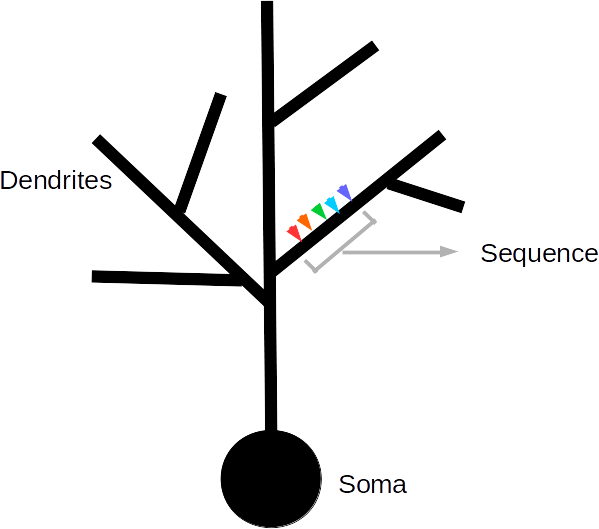

List of projects for GSoc 2018

_We are part of [INCF organization](https://www.incf.org/). To apply to these projects, please visit https://www.incf.org/collaborate/tool-development/google-summer-of-code_ and follow instructions there. Feel free to contact any mentors on [INCF group on Trellis](https://www.trelliscience.com/#/group-home/1823) or over email.

# Efficient Estimation/Optimization of Biochemical Models in MOOSE Simulator

__Mentors__: Upinder Bhalla (​bhalla@ncbs.res.in​ ) , Dilawar Singh (dilawars@ncbs.res.in)

MOOSE​ (Multiscale Object Oriented Simulation Environment) is designed to simulate multiscale neural networks e.g. it can simulate detailed electrical neural model with localised biochemical reactions. These underlying biochemical pathways are fundamental to the diverse computation a neuron performs

The set of reactions and molecular players involved in a biochemical pathway are usually known. One can collect the outcomes of various experiments from the literature. Given the reaction network and experimental data, the aim of this project to estimate the model (e.g. rate parameters of reactions, concentration of intermediate species) such that the model can ‘explain/fit’ the experimental data with ‘reasonable’ accuracy. In other words, it is an optimization problem where the parameters of the model need to be tweaked by the optimizer so that the model does a good job of replicating the available data.

In particular, this project involves following major tasks.

- Chemical models given in SBML (or MOOSE) and set of experimental results given in a table, one need to formulate the optimization problem H​. Language: Python. XML parsing. ​Familiarity with python-libsbml is plus.
- Find strategies to efficiently solve H​. Language: Python for prototyping.  
- Implement final strategy as a solver in moose in C++. Familiarity with Gnu Scientific Library and/or boost libraries.
- Optional: ​CUDA/OpenMP/multithreaded implementation.

The student should be familiar with scientific computing in Python and C++. He/she should also be familiar with optimization techniques involved in model estimation. Familiarity with parallelizing of algorithms using CUDA/OpenMP is plus.

Programming Languages: ​Python, C++, CUDA/OpenMP (optional).

Skill Set: ​Optimization techniques, Model estimation, Concurrent Programming.

# Optimization/Parallelization of Neural Networks with Sequence Recognizing Elements in MOOSE Simulator

__Mentors__: Upinder Bhalla (​bhalla@ncbs.res.in​ ) , Bhanu Priya (bhanups@ncbs.res.in)

Biological neurons are different from the logistic units used in artificial neural networks in several ways. The complexity and diversity in biological neurons can give rise different types of interesting computations, such as sequence recognition by individual neurons. The ​MOOSE​ (Multiscale Object Oriented Simulation Environment) is a tool that can be used to explore such computations at multiple scales using abstract as well detailed models.

Currently MOOSE implements sequence recognition in abstract model neurons suitable for making large neural networks. The aim of this project is to optimize and parallelize this feature, in order to improve the computational efficiency.

The tasks involved in this project are

- Familiarity with MOOSE C++ core (​Previous Work​)
- Write a parallel solver for sequence recognizer.
- Benchmarks and tests for solver.

The student should be familiar with C++ and Python (optional). Knowledge of parallelization and code optimization techniques is highly desirable. Familiarity with GNU Scientific Library is required. Familiarity with BOOST libraries is a plus.

Programming Languages: ​C++, Python (optional)

Skill Set: ​Optimization techniques, Parallelization techniques

# Details

At any point in time neurons receive many inputs at different locations on their dendrites. When some of these arriving inputs converge onto short stretches of dendrites such that they arrive in the same spatial order as their temporal activity, they can give rise to interesting computations such as sequence discrimination. The different colored inputs in the figure above represent inputs arriving at successive time steps at successive locations. 

The current implementation of sequence recognition is such that at each time step, the inputs coming to all locations are scanned serially to identify sequential activity. The aim of the GSoC project is to implement a Solver that can parallelize and optimize this operation. The Solver needs to be implemented in C++. For details about existing solvers in MOOSE you can refer to GSolve and KSolve.   

The tasks involved in this project are
1. Familiarity with MOOSE C++ core 
2. Write a solver in C++ for parallelizing the sequence recognizer.
3. Design benchmarks and tests for solver.

For familiarizing with MOOSE architecture, you can refer to the following links:   https://github.com/BhallaLab/GSoC/blob/master/GSoC-2014.md#moose--an-overview-moose--an-overview
https://github.com/BhallaLab/GSoC/blob/master/GSoC-2014.md#the-moose-api-part-1-the-moose-api-part-1
https://github.com/BhallaLab/GSoC/blob/master/GSoC-2014.md#the-moose-api-part-2-the-moose-api-part-2

Code related to the Sequence Recognizer can be found in:
https://github.com/BhallaLab/moose-core/blob/master/synapse/SeqSynHandler.cpp
The information is stored about the location and timing of inputs arriving at the dendrites is stored in a Rolling Matrix.
https://github.com/BhallaLab/moose-core/blob/master/synapse/RollingMatrix.cpp

For existing Solvers in MOOSE:
Developer Documentation - https://moose.ncbs.res.in/doxygen/classGsolve.html
Source code - https://github.com/BhallaLab/moose-core/tree/master/ksolve
